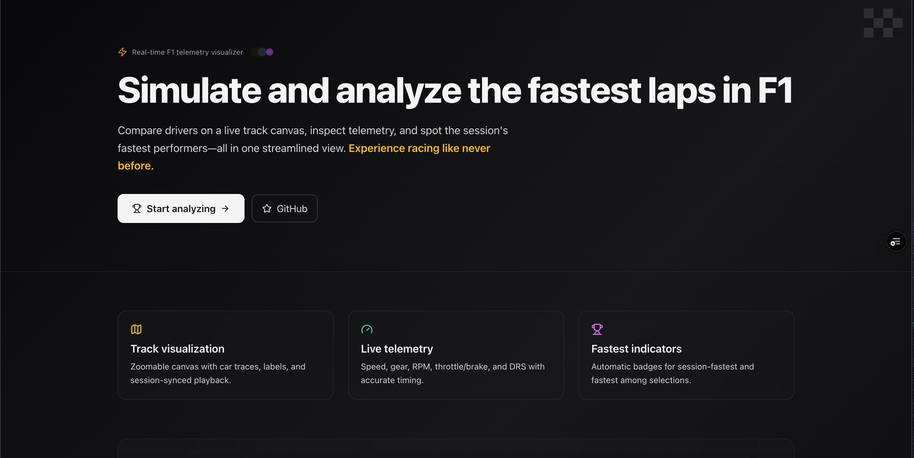
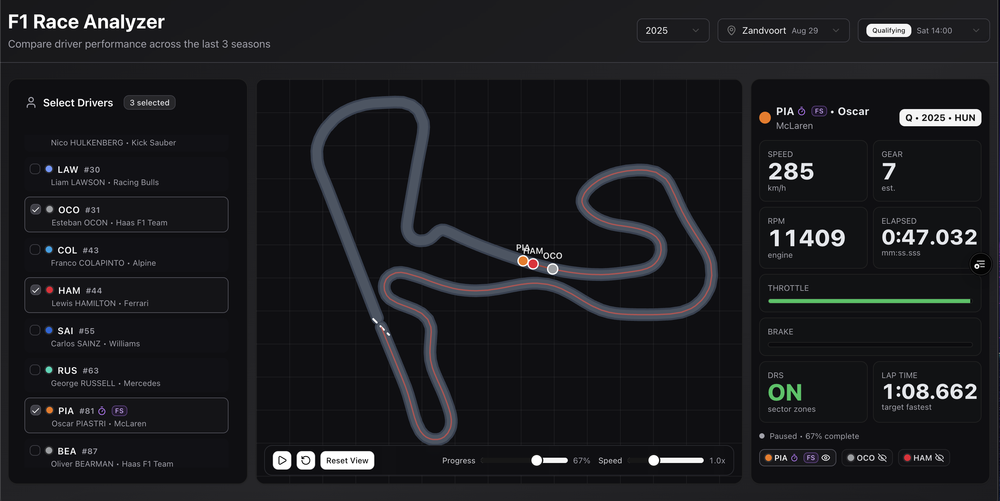

<div align="center">

# F1 Fastest Lap Simulator

Compare F1 drivers lap-by-lap with a live track canvas and synchronized telemetry.

[](https://nextjs.org)
[](https://react.dev)
[](https://www.typescriptlang.org)
[](https://tailwindcss.com)
[](https://tanstack.com/query)
[](https://github.com/pmndrs/zustand)
[](https://vercel.com)

</div>

---

- Live demo: https://f1-fastest-lap-simulator-web-app.vercel.app/home
- Analyzer: https://f1-fastest-lap-simulator-web-app.vercel.app/analyse

If your deployment URL differs, update these links here.

## ✨ Features

- 🗺️ Track visualization: Zoomable canvas with car traces, labels, and a subtle grid background.
- ⏱️ Synced playback: One unified control bar for play/pause, reset, speed, and progress.
- 👥 Driver selection: Compact list with acronyms, numbers, team colors, and selection checkboxes.
- 🚀 Fastest indicators: Session “overall fastest” stopwatch and “FS” badge for fastest among selected.
- 📊 Telemetry panel: Speed, gear, RPM, throttle/brake, and exact DRS mapping (0/1 OFF, 10/12/14 ON).
- 🕒 Accurate timing: Master timeline sync, per-driver lap clamping, and mm:ss.sss formatting.
- 📱 Mobile-ready: Responsive layout, compact tiles, and touch-friendly sliders without horizontal scroll.
- 🏠 Landing + Analyzer: Clean landing page at `/home` and the analyzer at `/analyse` with root redirect.

## 🖼️ Screenshots

<p align="center">
	
	
<br/>
	<em>Home and Analyzer views</em>
</p>

## 🛠️ Tech Stack

- Next.js 15, React 19, TypeScript
- Tailwind CSS, shadcn/ui, Lucide Icons
- TanStack React Query v5
- Zustand for global animation/state
- Canvas 2D for track rendering
- OpenF1 API as the data source

## 🚀 Quick Start

Clone and run the dev server:

```bash
git clone https://github.com/sgsjha/F1_FastestLap_Simulator_WebApp.git
cd F1_FastestLap_Simulator_WebApp
npm install
npm run dev
```

Open http://localhost:3000

## 📦 Scripts

- dev: Start the development server
- build: Production build
- start: Run the production server
- lint: Lint the codebase

## 🧭 Project Structure

```
src/
	app/
		home/           # Landing page
		analyse/        # Analyzer UI
		race/[sessionKey]/
	components/
		driver-selector/
		race-selector/
		telemetry-panel/
		track-visualization/
		ui/             # shadcn/ui components
	lib/
		api/openf1.ts   # OpenF1 API utils
		store/raceStore.ts
		utils/          # helpers like lapCalculator.ts
```

## 🔌 Data Source

This project uses the public OpenF1 API for session, driver, lap, and car data.

## 🗺️ Roadmap

- Speed step buttons (+/−) for very small screens
- Optional in-canvas fastest indicator on car labels
- Additional charts and export options

## 🤝 Contributing

Issues and PRs are welcome. If you spot a bug or want to improve UX, open an issue with details and repro steps.

## 📬 Contact

- LinkedIn: https://www.linkedin.com/in/sarthak-jhaa/
- GitHub: https://github.com/sgsjha
- Instagram: https://instagram.com/sarthak.jhaa

---

Built with passion for racing. 🏁
